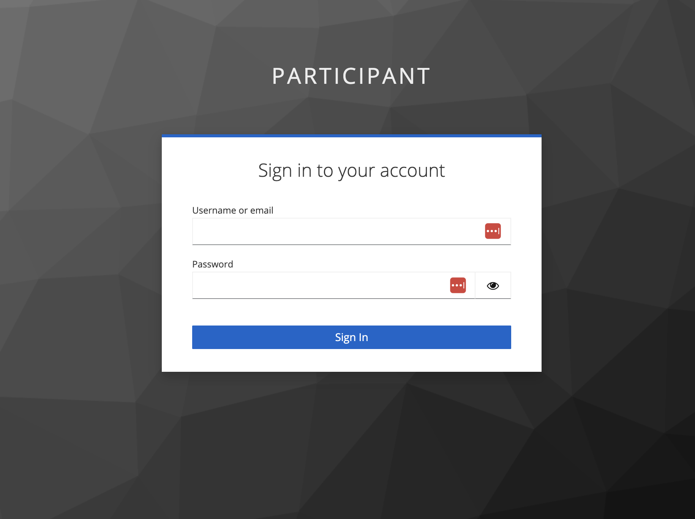
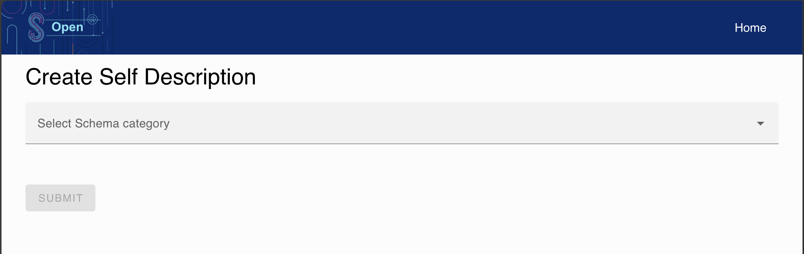
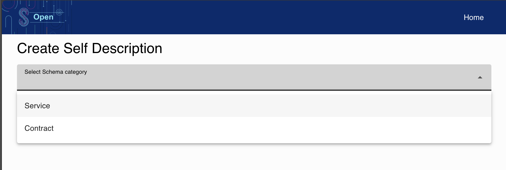
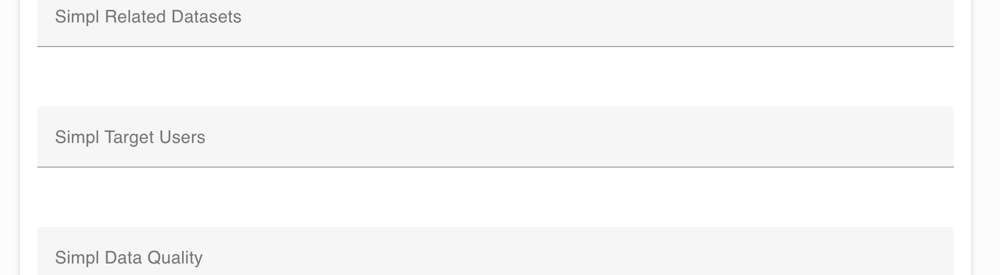
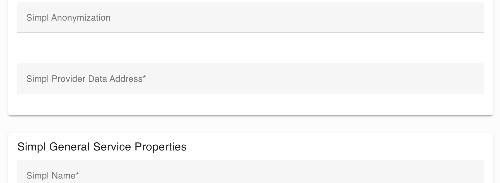
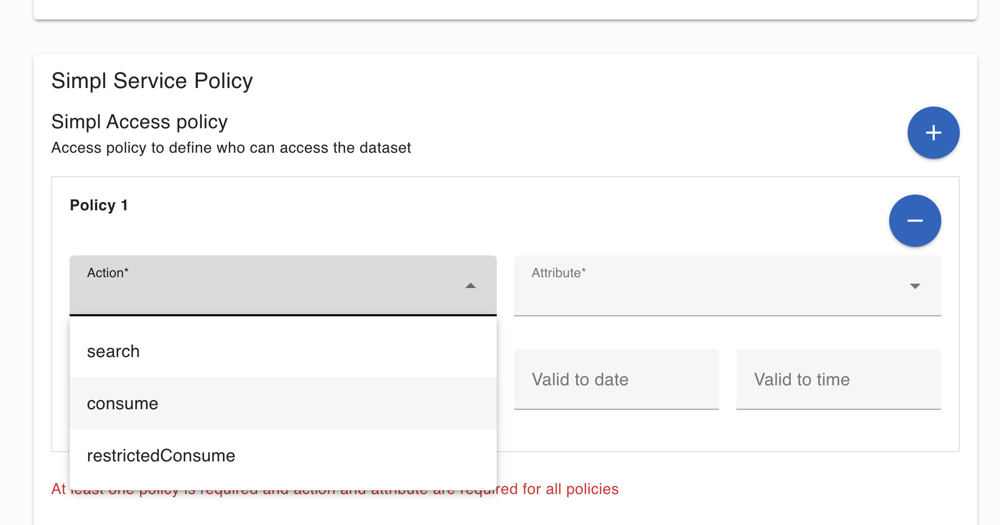
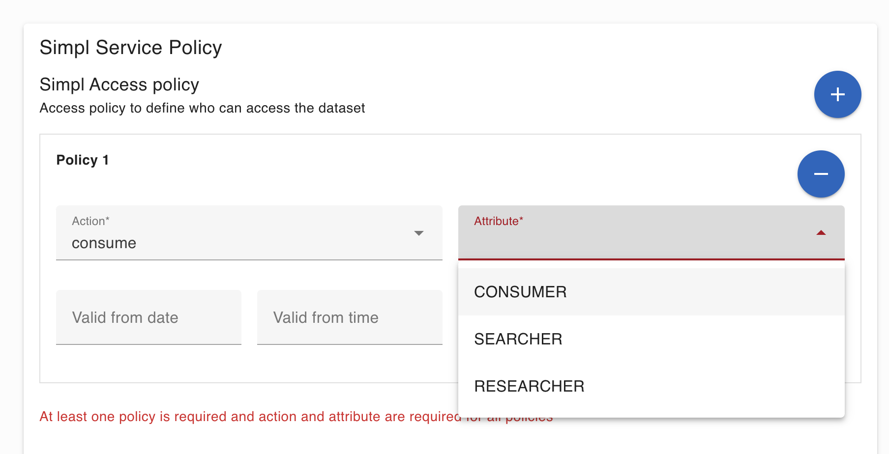
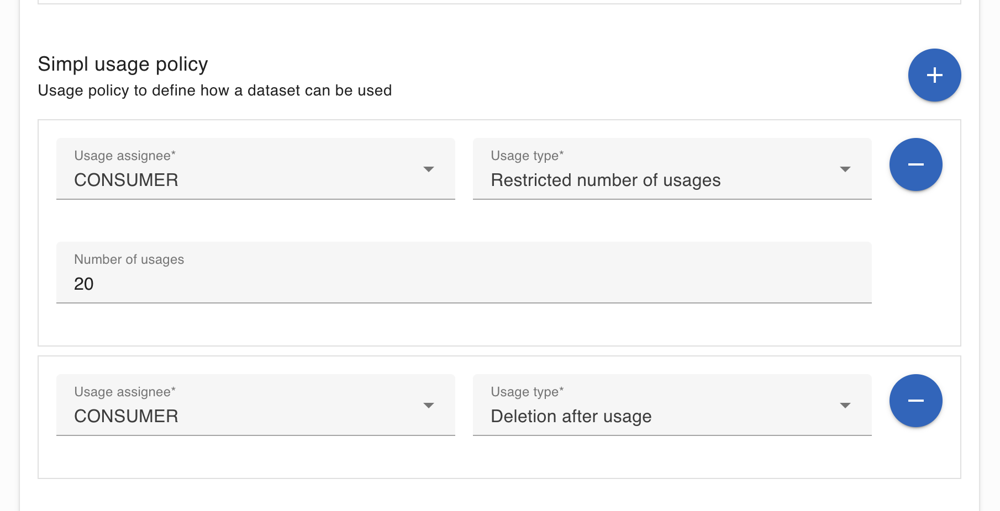
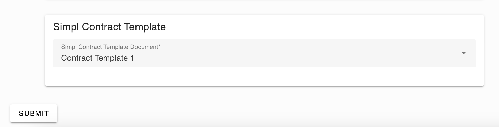
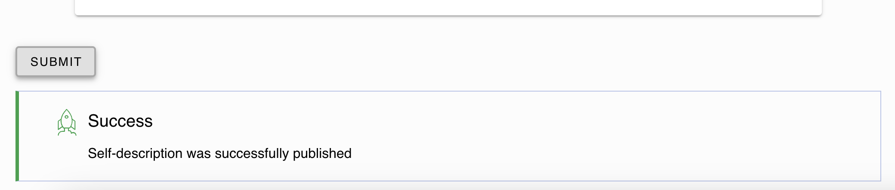

Following a description of fields involved in SD-Tooling in order to create a Self-Description

# SD-Tooling fields

Below are the instructions for filling in certain fields of the SD Tooling.

# Common fields

Common fields for data/application/infrastructure.

## General Service Properties

### Name
A short text title for the dataset/application/infrastructure.

### Description
A description for the dataset/application/infrastructure.

### Service Access Point
The location where the dataset/application/infrastructure can be found (likely an endpoint URL).

### Keywords
Keywords.

### In Language
Language (of the metadata, like the title, description).


## Provider Information

### Provided By
A reference to ID of the dataset/application/infrastructure provider.

### Contact
Who to contact in case of questions/issues.

### Signature
A digital signature that ensures that the provider is the one that uploaded the Self-description.


## Offering Price

### License
URL to the used license.

### Currency
Price and conditions.

### Price
Price and conditions.

### Price Type
Price type ('free, commercial').


## Service Policy

### Access Policy
Access policy to define who can access the dataset.

### Usage Policy
Usage policy to define how a dataset can be used.

### Data Protection Regime
Indicates compliance with relevant data protection regulations and standards.


## Contract Template

### Contract Template Document
Indicates Contract Template Document.


# Specific Fields for Data Offering

### Produced By
Provenance.

### Format
Format under which the data is distributed (e.g. csv, xml, …).

### Open Api
Schema of the dataset, depends on the type of data for JSON it would be JSON Schema Description that states what fields the data has and the types.

### Additional Info
Additional Information about the dataset.

### Related Datasets
Related Datasets.

### Target Users
Target Users.

### Data Quality
Data Quality (to include metrics such as completeness, accuracy, timeliness and other).

### Encryption
Encryption: Describes the encryption algorithms and keys used to secure the data.

### Anonymization
Anonymization/pseudonymization: Indicates whether sensitive information has been anonymized or pseudonymized to protect privacy.

### Provider Data Address

This is a JSON field containing information for managing the transfer of content from the provider's S3 bucket to the consumer's S3 bucket via the EDC connector. In summary, the EDC Connector S3 extension uses this information to move the content from the provider's S3 bucket to the consumer's S3 bucket.

```bash
{
     "type": "IonosS3",
     "region": "de",
     "storage":"s3-eu-central-1.ionoscloud.com",
     "bucketName": "simpl-provider",
     "blobName": "european_health_data.csv",
     "keyName":"test-key-name"
  }

```

* **type**: it represents the type of S3 provider.
* **region**: it represents the region where the provider's S3 bucket is located.
* **storage**: it represents the S3 service URL used by the provider.
* **bucketName**: it represents the provider bucket name
* **blobName**: it represents the provider blob/content/file name to be transferred
* **accessKey**: it represents the access key for accessing the provider's bucket.
* **secretKey**: it represents the secret key for accessing the provider's bucket.
* **keyName**: it represents the key alias name for accessing the provider's bucket.


# Specific Fields for Application Offering

### Package
Application package.

### Link
Application link.

### Link
Application link.

### Open Api
Format under which the application is distributed (e.g. docker image, executable package, ...). Might be more than one format available for the same application.

### Target Users
Target users.

### Requirements
Requirements on the runtime environment (useful for the deployment in the infrastructure provider).

### Url
URL of the documentation on how to use the application.

### Provider Data Address

This is a JSON field containing information for managing the transfer of content from the provider's S3 bucket to the consumer's S3 bucket via the EDC connector. In summary, the EDC Connector S3 extension uses this information to move the content from the provider's S3 bucket to the consumer's S3 bucket.

```bash
{
     "type": "IonosS3",
     "region": "de",
     "storage":"s3-eu-central-1.ionoscloud.com",
     "bucketName": "simpl-provider",
     "blobName": "european_health_data.csv",
     "keyName":"test-key-name"
  }

```

* **type**: it represents the type of S3 provider.
* **region**: it represents the region where the provider's S3 bucket is located.
* **storage**: it represents the S3 service URL used by the provider.
* **bucketName**: it represents the provider bucket name
* **blobName**: it represents the provider blob/content/file name to be transferred
* **accessKey**: it represents the access key for accessing the provider's bucket.
* **secretKey**: it represents the secret key for accessing the provider's bucket.
* **keyName**: it represents the key alias name for accessing the provider's bucket.


# Specific Fields for infrastructure Offering

### Target Users
Target users.

### Requirements
Requirements on the runtime environment (useful for the deployment in the infrastructure provider).

### Url
URL of the documentation on how to use the application.

### Resource Type
Resource Type.

### Region And Az
Region And Availability.

### Size And Cap
Size and Capacity.

### Os And Image
Operating System and Image.

### Network Configuration
Network Configuration.

### Security Settings
Security Settings.

### Instance Type
Instance Type.

### Storage Type
Instance Type.

### Backup
Backup And Redundancy.

### Scalability
Scalability Options.

### Monitoring
Monitoring and Logging.

### Tags
Tags and Metadata.

### External Url
External Url.

### Deployment Script Id
Deployment Script Id.

### Provisioner Api
Provisioner Api.

# Self-Description Creation UI

This application allows users to create self-descriptions and publish them to the catalogue. There are multiple types of self-descriptions, each defined by a schema. The application retrieves the available schemas from the self-description creation backend, displays all the fields defined in the schema, and applies every validation rule from it.

After filling out the form, the creation process is performed in the background through the following steps:
1. **Enrichment and validation**
2. **Signing**
3. **Publishing to the catalogue**

> **Note**: To use this application, you must log in with a user that has the `SD_PUBLISHER` permission.

---

## Usage

The application in the development environment is available at:  
[https://sd-ui.dev.simpl-europe.eu/](https://sd-ui.dev.simpl-europe.eu/)

### Login
When opening the application, you will be automatically redirected to the login page:



---

### Main Screen
After logging in, you'll see the main screen with a dropdown to select schema categories:



---

### Selecting a Schema
1. **Choose your preferred schema category**:
    - Currently, only the **"Service"** category has implemented functionality.
    - The **"Contract"** category will display a form but will show an error upon submission.

2. **Service Category**:  
   Inside this category, you can select from available schemas. Currently, **Data Offerings** and **Infrastructure Offerings** provide complete functionality.



#### Data Offerings Example
- Select the `data-offeringShape.ttl` option.
- Fill out all fields with the desired values.
    - Fields with validation rules will display errors if the input is invalid.
    - The form can only be submitted if all fields are valid.
- Fields marked with an asterisk (`*`) are mandatory.

---

### Known Issues
1. **Simpl Target Users**:
    - Leave this field empty; otherwise, the creation process will fail.
    - **Bug Ticket**: `SIMPL-8575`

   

2. **Simpl Provider Data Address**:
    - This field requires a valid JSON format, but the UI does not validate it properly.
    - Use a valid Amazon S3 storage bucket address.
    - **Example**:
      ```json
      {
        "type": "IonosS3",
        "region": "de",
        "storage": "s3-eu-central-1.ionoscloud.com",
        "bucketName": "simpl-provider",
        "blobName": "european_health_data.csv",
        "keyName": "test-key-name"
      }
      ```

   

---

### Access Policies
Define access policies to determine who can access the offering.
- **At least one policy is required.**
- Recommended setup:
    - Assign the `"consume"` action to the `"CONSUMER"` attribute.
    - Without this policy, the offering will not appear in the catalogue.
- Optionally, set a **valid from** and **valid to** date/time to restrict access to a specific timeframe.





---

### Usage Policies
Define how the offering can be used within the **Usage Policy** section.



---

### Submission
- Once all fields are correctly filled out, the **"Submit"** button will become active.
- Clicking **Submit** initiates the multistep creation process:
    1. Enrichment and validation
    2. Signing
    3. Publishing to the catalogue



---

### Success Message
If the creation process completes successfully, you will see the following message:



---

### Error Handling
In case of issues, a red error message will appear instead of the success message.  
Review the error message and adjust the form inputs accordingly.

---

Following API description implemented by microservice

[OPEN API description](openapi.json)

```json
{
	"openapi": "3.0.1",
	"info": {
		"title": "SD Tooling API",
		"description": "OpenApi documentation for the SD Tooling Application",
		"version": "1.0"
	},
	"servers": [
		{
			"url": "http://localhost:8085",
			"description": "Generated server url"
		}
	],
	"security": [
		{
			"bearerAuth": []
		}
	],
	"paths": {
		"/generate-hash-ttl": {
			"post": {
				"tags": [
					"Hash Controller"
				],
				"summary": "Generate hash by ttl",
				"description": "Add the hash parameters",
				"operationId": "generateHashFromTtl",
				"parameters": [
					{
						"name": "ecosystem",
						"in": "query",
						"required": true,
						"schema": {
							"type": "string"
						}
					},
					{
						"name": "shapeFileName",
						"in": "query",
						"required": true,
						"schema": {
							"type": "string"
						}
					}
				],
				"requestBody": {
					"content": {
						"application/json": {
							"schema": {
								"required": [
									"ttl-file"
								],
								"type": "object",
								"properties": {
									"ttl-file": {
										"type": "string",
										"format": "binary"
									}
								}
							}
						}
					}
				},
				"responses": {
					"400": {
						"description": "Bad Request",
						"content": {
							"application/problem+json": {
								"schema": {
									"$ref": "#/components/schemas/ErrorResponse"
								}
							}
						}
					},
					"401": {
						"description": "Unauthorized",
						"content": {
							"application/problem+json": {
								"schema": {
									"$ref": "#/components/schemas/ErrorResponse"
								}
							}
						}
					},
					"500": {
						"description": "Internal Server Error",
						"content": {
							"application/problem+json": {
								"schema": {
									"$ref": "#/components/schemas/ErrorResponse"
								}
							}
						}
					},
					"200": {
						"description": "OK",
						"content": {
							"*/*": {
								"schema": {
									"type": "string"
								}
							}
						}
					}
				},
				"deprecated": true
			}
		},
		"/generate-hash-jsonld": {
			"post": {
				"tags": [
					"Hash Controller"
				],
				"summary": "Generate hash by jsonld",
				"description": "Add the hash parameters",
				"operationId": "generateHashFromJson",
				"parameters": [
					{
						"name": "ecosystem",
						"in": "query",
						"required": true,
						"schema": {
							"type": "string"
						}
					},
					{
						"name": "shapeFileName",
						"in": "query",
						"required": true,
						"schema": {
							"type": "string"
						}
					}
				],
				"requestBody": {
					"content": {
						"application/json": {
							"schema": {
								"required": [
									"jsonld-file"
								],
								"type": "object",
								"properties": {
									"jsonld-file": {
										"type": "string",
										"format": "binary"
									}
								}
							}
						}
					}
				},
				"responses": {
					"400": {
						"description": "Bad Request",
						"content": {
							"application/problem+json": {
								"schema": {
									"$ref": "#/components/schemas/ErrorResponse"
								}
							}
						}
					},
					"401": {
						"description": "Unauthorized",
						"content": {
							"application/problem+json": {
								"schema": {
									"$ref": "#/components/schemas/ErrorResponse"
								}
							}
						}
					},
					"500": {
						"description": "Internal Server Error",
						"content": {
							"application/problem+json": {
								"schema": {
									"$ref": "#/components/schemas/ErrorResponse"
								}
							}
						}
					},
					"200": {
						"description": "OK",
						"content": {
							"*/*": {
								"schema": {
									"type": "string"
								}
							}
						}
					}
				},
				"deprecated": true
			}
		},
		"/convertFile": {
			"post": {
				"tags": [
					"Conversion Controller"
				],
				"summary": "Convert file to json",
				"description": "Return json file",
				"operationId": "convertShacl",
				"requestBody": {
					"content": {
						"application/json": {
							"schema": {
								"required": [
									"file"
								],
								"type": "object",
								"properties": {
									"file": {
										"type": "string",
										"format": "binary"
									}
								}
							}
						}
					}
				},
				"responses": {
					"400": {
						"description": "Bad Request",
						"content": {
							"application/problem+json": {
								"schema": {
									"$ref": "#/components/schemas/ErrorResponse"
								}
							}
						}
					},
					"401": {
						"description": "Unauthorized",
						"content": {
							"application/problem+json": {
								"schema": {
									"$ref": "#/components/schemas/ErrorResponse"
								}
							}
						}
					},
					"500": {
						"description": "Internal Server Error",
						"content": {
							"application/problem+json": {
								"schema": {
									"$ref": "#/components/schemas/ErrorResponse"
								}
							}
						}
					},
					"200": {
						"description": "OK",
						"content": {
							"application/json": {
								"schema": {
									"type": "object"
								}
							}
						}
					}
				},
				"deprecated": true
			}
		},
		"/api/sd/publish": {
			"post": {
				"tags": [
					"SD Controller"
				],
				"operationId": "publish",
				"requestBody": {
					"content": {
						"multipart/form-data": {
							"schema": {
								"required": [
									"json-file"
								],
								"type": "object",
								"properties": {
									"json-file": {
										"type": "string",
										"description": "SD json file",
										"format": "binary"
									}
								}
							}
						}
					}
				},
				"responses": {
					"400": {
						"description": "Bad Request",
						"content": {
							"application/problem+json": {
								"schema": {
									"$ref": "#/components/schemas/ErrorResponse"
								}
							}
						}
					},
					"503": {
						"description": "Service Unavailable",
						"content": {
							"application/problem+json": {
								"schema": {
									"$ref": "#/components/schemas/ErrorResponse"
								}
							}
						}
					},
					"401": {
						"description": "Unauthorized",
						"content": {
							"application/problem+json": {
								"schema": {
									"$ref": "#/components/schemas/ErrorResponse"
								}
							}
						}
					},
					"500": {
						"description": "Internal Server Error",
						"content": {
							"application/problem+json": {
								"schema": {
									"$ref": "#/components/schemas/ErrorResponse"
								}
							}
						}
					},
					"200": {
						"description": "OK",
						"content": {
							"application/json": {
								"schema": {
									"type": "string"
								}
							}
						}
					}
				}
			}
		},
		"/api/sd/enrichAndValidate": {
			"post": {
				"tags": [
					"SD Controller"
				],
				"summary": "Register a SD json LD and return it enriched and validated",
				"description": "Add hashings, register asset and policies on EDC connector, create a contract definition on EDC connector and validate the resulting SD json enriched with all info",
				"operationId": "enrichAndValidate",
				"parameters": [
					{
						"name": "ecosystem",
						"in": "query",
						"description": "Ecosystem name",
						"required": true,
						"schema": {
							"type": "string",
							"description": "Ecosystem name",
							"example": "simpl"
						},
						"example": "simpl"
					},
					{
						"name": "shapeFileName",
						"in": "query",
						"description": "File name",
						"required": true,
						"schema": {
							"type": "string",
							"description": "File name",
							"example": "data-offeringShape.ttl"
						},
						"example": "data-offeringShape.ttl"
					}
				],
				"requestBody": {
					"content": {
						"multipart/form-data": {
							"schema": {
								"required": [
									"json-file"
								],
								"type": "object",
								"properties": {
									"json-file": {
										"type": "string",
										"description": "SD json file",
										"format": "binary"
									}
								}
							}
						}
					}
				},
				"responses": {
					"400": {
						"description": "Bad Request",
						"content": {
							"application/problem+json": {
								"schema": {
									"$ref": "#/components/schemas/ErrorResponse"
								}
							}
						}
					},
					"503": {
						"description": "Service Unavailable",
						"content": {
							"application/problem+json": {
								"schema": {
									"$ref": "#/components/schemas/ErrorResponse"
								}
							}
						}
					},
					"401": {
						"description": "Unauthorized",
						"content": {
							"application/problem+json": {
								"schema": {
									"$ref": "#/components/schemas/ErrorResponse"
								}
							}
						}
					},
					"500": {
						"description": "Internal Server Error",
						"content": {
							"application/problem+json": {
								"schema": {
									"$ref": "#/components/schemas/ErrorResponse"
								}
							}
						}
					},
					"200": {
						"description": "Successfully enriched and validated SD JSON-LD",
						"content": {
							"application/json": {
								"schema": {
									"type": "object"
								},
								"examples": {
									"SD JSON-LD enriched": {
										"description": "SD JSON-LD enriched",
										"value": "Json file enriched and validated"
									}
								}
							}
						}
					}
				}
			}
		},
		"/api/policy/usage": {
			"post": {
				"tags": [
					"Policy Controller"
				],
				"summary": "Generate usage policy json-ld",
				"description": "Returns the usage policy json-ld for the specified input parameters passed as json",
				"operationId": "getUsagePolicyJsonLD",
				"requestBody": {
					"content": {
						"application/json": {
							"schema": {
								"$ref": "#/components/schemas/UsagePolicyRequest"
							}
						}
					},
					"required": true
				},
				"responses": {
					"400": {
						"description": "Bad Request",
						"content": {
							"application/problem+json": {
								"schema": {
									"$ref": "#/components/schemas/ErrorResponse"
								}
							}
						}
					},
					"401": {
						"description": "Unauthorized",
						"content": {
							"application/problem+json": {
								"schema": {
									"$ref": "#/components/schemas/ErrorResponse"
								}
							}
						}
					},
					"500": {
						"description": "Internal Server Error",
						"content": {
							"application/problem+json": {
								"schema": {
									"$ref": "#/components/schemas/ErrorResponse"
								}
							}
						}
					},
					"200": {
						"description": "OK",
						"content": {
							"application/json": {
								"schema": {
									"$ref": "#/components/schemas/OdrlPolicy"
								}
							}
						}
					}
				}
			}
		},
		"/api/policy/access": {
			"post": {
				"tags": [
					"Policy Controller"
				],
				"summary": "Generate access policy json-ld",
				"description": "Returns the access policy json-ld for the specified input parameters passed as json",
				"operationId": "getAccessPolicyJsonLD",
				"requestBody": {
					"content": {
						"application/json": {
							"schema": {
								"$ref": "#/components/schemas/AccessPolicyRequest"
							}
						}
					},
					"required": true
				},
				"responses": {
					"400": {
						"description": "Bad Request",
						"content": {
							"application/problem+json": {
								"schema": {
									"$ref": "#/components/schemas/ErrorResponse"
								}
							}
						}
					},
					"401": {
						"description": "Unauthorized",
						"content": {
							"application/problem+json": {
								"schema": {
									"$ref": "#/components/schemas/ErrorResponse"
								}
							}
						}
					},
					"500": {
						"description": "Internal Server Error",
						"content": {
							"application/problem+json": {
								"schema": {
									"$ref": "#/components/schemas/ErrorResponse"
								}
							}
						}
					},
					"200": {
						"description": "OK",
						"content": {
							"application/json": {
								"schema": {
									"$ref": "#/components/schemas/OdrlPolicy"
								}
							}
						}
					}
				}
			}
		},
		"/api/contract/v1/validate": {
			"post": {
				"tags": [
					"Contract Controller"
				],
				"summary": "Return json validated",
				"description": "Return the json-ld validated",
				"operationId": "contractValidate",
				"parameters": [
					{
						"name": "ecosystem",
						"in": "query",
						"description": "Ecosystem name",
						"required": true,
						"schema": {
							"type": "string",
							"description": "Ecosystem name",
							"example": "simpl"
						},
						"example": "simpl"
					},
					{
						"name": "shapeFileName",
						"in": "query",
						"description": "File name",
						"required": true,
						"schema": {
							"type": "string",
							"description": "File name",
							"example": "contract-templateShape.ttl"
						},
						"example": "contract-templateShape.ttl"
					}
				],
				"requestBody": {
					"content": {
						"multipart/form-data": {
							"schema": {
								"required": [
									"json-file"
								],
								"type": "object",
								"properties": {
									"json-file": {
										"type": "string",
										"description": "SD json file",
										"format": "binary"
									}
								}
							}
						}
					}
				},
				"responses": {
					"400": {
						"description": "Bad Request",
						"content": {
							"application/problem+json": {
								"schema": {
									"$ref": "#/components/schemas/ErrorResponse"
								}
							}
						}
					},
					"401": {
						"description": "Unauthorized",
						"content": {
							"application/problem+json": {
								"schema": {
									"$ref": "#/components/schemas/ErrorResponse"
								}
							}
						}
					},
					"500": {
						"description": "Internal Server Error",
						"content": {
							"application/problem+json": {
								"schema": {
									"$ref": "#/components/schemas/ErrorResponse"
								}
							}
						}
					},
					"200": {
						"description": "Successfully validated SD JSON-LD",
						"content": {
							"application/json": {
								"schema": {
									"type": "object"
								},
								"examples": {
									"SD JSON-LD validated": {
										"description": "SD JSON-LD validated",
										"value": "Json file validated"
									}
								}
							}
						}
					}
				}
			}
		},
		"/getTTL": {
			"get": {
				"tags": [
					"Conversion Controller"
				],
				"summary": "Get ttl schema file based on ecosystem and file name",
				"description": "Return the file shape ttl if present",
				"operationId": "getTTL",
				"parameters": [
					{
						"name": "ecosystem",
						"in": "query",
						"description": "Ecosystem name",
						"required": true,
						"schema": {
							"type": "string",
							"description": "Ecosystem name",
							"example": "simpl"
						},
						"example": "simpl"
					},
					{
						"name": "fileName",
						"in": "query",
						"description": "File name",
						"required": true,
						"schema": {
							"type": "string",
							"description": "File name",
							"example": "data-offeringShape.ttl"
						},
						"example": "data-offeringShape.ttl"
					}
				],
				"responses": {
					"400": {
						"description": "Bad Request",
						"content": {
							"application/problem+json": {
								"schema": {
									"$ref": "#/components/schemas/ErrorResponse"
								}
							}
						}
					},
					"401": {
						"description": "Unauthorized",
						"content": {
							"application/problem+json": {
								"schema": {
									"$ref": "#/components/schemas/ErrorResponse"
								}
							}
						}
					},
					"500": {
						"description": "Internal Server Error",
						"content": {
							"application/problem+json": {
								"schema": {
									"$ref": "#/components/schemas/ErrorResponse"
								}
							}
						}
					},
					"200": {
						"description": "OK",
						"content": {
							"*/*": {
								"schema": {
									"type": "string"
								}
							}
						}
					}
				}
			}
		},
		"/getSearchQuery/{ecoSystem}/{query}": {
			"get": {
				"tags": [
					"Conversion Controller"
				],
				"summary": "Get search query",
				"description": "Return search query",
				"operationId": "getSearchQuery",
				"parameters": [
					{
						"name": "ecoSystem",
						"in": "path",
						"required": true,
						"schema": {
							"type": "string"
						}
					},
					{
						"name": "query",
						"in": "path",
						"required": true,
						"schema": {
							"type": "string"
						}
					}
				],
				"responses": {
					"400": {
						"description": "Bad Request",
						"content": {
							"application/problem+json": {
								"schema": {
									"$ref": "#/components/schemas/ErrorResponse"
								}
							}
						}
					},
					"401": {
						"description": "Unauthorized",
						"content": {
							"application/problem+json": {
								"schema": {
									"$ref": "#/components/schemas/ErrorResponse"
								}
							}
						}
					},
					"500": {
						"description": "Internal Server Error",
						"content": {
							"application/problem+json": {
								"schema": {
									"$ref": "#/components/schemas/ErrorResponse"
								}
							}
						}
					},
					"200": {
						"description": "OK",
						"content": {
							"*/*": {
								"schema": {
									"type": "object",
									"additionalProperties": {
										"type": "array",
										"items": {
											"type": "string"
										}
									}
								}
							}
						}
					}
				},
				"deprecated": true
			}
		},
		"/getJSON": {
			"get": {
				"tags": [
					"Conversion Controller"
				],
				"summary": "Get JSON",
				"description": "Return json file",
				"operationId": "getJSON",
				"parameters": [
					{
						"name": "ecosystem",
						"in": "query",
						"required": true,
						"schema": {
							"type": "string"
						}
					},
					{
						"name": "name",
						"in": "query",
						"required": true,
						"schema": {
							"type": "string"
						}
					}
				],
				"responses": {
					"400": {
						"description": "Bad Request",
						"content": {
							"application/problem+json": {
								"schema": {
									"$ref": "#/components/schemas/ErrorResponse"
								}
							}
						}
					},
					"401": {
						"description": "Unauthorized",
						"content": {
							"application/problem+json": {
								"schema": {
									"$ref": "#/components/schemas/ErrorResponse"
								}
							}
						}
					},
					"500": {
						"description": "Internal Server Error",
						"content": {
							"application/problem+json": {
								"schema": {
									"$ref": "#/components/schemas/ErrorResponse"
								}
							}
						}
					},
					"200": {
						"description": "OK",
						"content": {
							"*/*": {
								"schema": {
									"type": "string"
								}
							}
						}
					}
				},
				"deprecated": true
			}
		},
		"/getAvailableShapes": {
			"get": {
				"tags": [
					"Conversion Controller"
				],
				"summary": "Get all available shapes file",
				"description": "Return all available shapes file",
				"operationId": "getAvailableShapes",
				"responses": {
					"400": {
						"description": "Bad Request",
						"content": {
							"application/problem+json": {
								"schema": {
									"$ref": "#/components/schemas/ErrorResponse"
								}
							}
						}
					},
					"401": {
						"description": "Unauthorized",
						"content": {
							"application/problem+json": {
								"schema": {
									"$ref": "#/components/schemas/ErrorResponse"
								}
							}
						}
					},
					"500": {
						"description": "Internal Server Error",
						"content": {
							"application/problem+json": {
								"schema": {
									"$ref": "#/components/schemas/ErrorResponse"
								}
							}
						}
					},
					"200": {
						"description": "OK",
						"content": {
							"*/*": {
								"schema": {
									"type": "object",
									"additionalProperties": {
										"type": "object",
										"additionalProperties": {
											"type": "array",
											"items": {
												"type": "string"
											}
										}
									}
								}
							}
						}
					}
				},
				"deprecated": true
			}
		},
		"/getAvailableShapesTtl": {
			"get": {
				"tags": [
					"Conversion Controller"
				],
				"summary": "Get all available shapes ttl file",
				"description": "Return all available shapes ttl file",
				"operationId": "getAvailableShapesTtl",
				"responses": {
					"400": {
						"description": "Bad Request",
						"content": {
							"application/problem+json": {
								"schema": {
									"$ref": "#/components/schemas/ErrorResponse"
								}
							}
						}
					},
					"401": {
						"description": "Unauthorized",
						"content": {
							"application/problem+json": {
								"schema": {
									"$ref": "#/components/schemas/ErrorResponse"
								}
							}
						}
					},
					"500": {
						"description": "Internal Server Error",
						"content": {
							"application/problem+json": {
								"schema": {
									"$ref": "#/components/schemas/ErrorResponse"
								}
							}
						}
					},
					"200": {
						"description": "OK",
						"content": {
							"*/*": {
								"schema": {
									"type": "object",
									"additionalProperties": {
										"type": "object",
										"additionalProperties": {
											"type": "array",
											"items": {
												"type": "string"
											}
										}
									}
								}
							}
						}
					}
				}
			}
		},
		"/getAvailableShapesTtlCategorized": {
			"get": {
				"tags": [
					"Conversion Controller"
				],
				"summary": "Get all available shapes ttl file based on ecosystem",
				"description": "Return all available shapes ttl file based on ecosystem",
				"operationId": "getAvailableShapesTtlCategorized",
				"parameters": [
					{
						"name": "ecosystem",
						"in": "query",
						"description": "Ecosystem name",
						"required": true,
						"schema": {
							"type": "string",
							"description": "Ecosystem name",
							"example": "simpl"
						},
						"example": "simpl"
					}
				],
				"responses": {
					"400": {
						"description": "Bad Request",
						"content": {
							"application/problem+json": {
								"schema": {
									"$ref": "#/components/schemas/ErrorResponse"
								}
							}
						}
					},
					"401": {
						"description": "Unauthorized",
						"content": {
							"application/problem+json": {
								"schema": {
									"$ref": "#/components/schemas/ErrorResponse"
								}
							}
						}
					},
					"500": {
						"description": "Internal Server Error",
						"content": {
							"application/problem+json": {
								"schema": {
									"$ref": "#/components/schemas/ErrorResponse"
								}
							}
						}
					},
					"200": {
						"description": "OK",
						"content": {
							"*/*": {
								"schema": {
									"type": "object",
									"additionalProperties": {
										"type": "array",
										"items": {
											"type": "string"
										}
									}
								}
							}
						}
					}
				}
			}
		},
		"/getAvailableShapesCategorized": {
			"get": {
				"tags": [
					"Conversion Controller"
				],
				"summary": "Get all the shapes of one specific ecosystem",
				"description": "Return shapes by ecosystem",
				"operationId": "getAvailableShapesCategorized",
				"parameters": [
					{
						"name": "ecosystem",
						"in": "query",
						"required": true,
						"schema": {
							"type": "string"
						}
					}
				],
				"responses": {
					"400": {
						"description": "Bad Request",
						"content": {
							"application/problem+json": {
								"schema": {
									"$ref": "#/components/schemas/ErrorResponse"
								}
							}
						}
					},
					"401": {
						"description": "Unauthorized",
						"content": {
							"application/problem+json": {
								"schema": {
									"$ref": "#/components/schemas/ErrorResponse"
								}
							}
						}
					},
					"500": {
						"description": "Internal Server Error",
						"content": {
							"application/problem+json": {
								"schema": {
									"$ref": "#/components/schemas/ErrorResponse"
								}
							}
						}
					},
					"200": {
						"description": "OK",
						"content": {
							"*/*": {
								"schema": {
									"type": "object",
									"additionalProperties": {
										"type": "array",
										"items": {
											"type": "string"
										}
									}
								}
							}
						}
					}
				},
				"deprecated": true
			}
		},
		"/api/policy/identity/attributes": {
			"get": {
				"tags": [
					"Policy Controller"
				],
				"summary": "Get CONSUMER type identity attributes",
				"description": "Returns all the identity attributes assigned to type CONSUMER from the Governance Authority",
				"operationId": "getIdentityAttributes",
				"responses": {
					"400": {
						"description": "Bad Request",
						"content": {
							"application/problem+json": {
								"schema": {
									"$ref": "#/components/schemas/ErrorResponse"
								}
							}
						}
					},
					"401": {
						"description": "Unauthorized",
						"content": {
							"application/problem+json": {
								"schema": {
									"$ref": "#/components/schemas/ErrorResponse"
								}
							}
						}
					},
					"500": {
						"description": "Internal Server Error",
						"content": {
							"application/problem+json": {
								"schema": {
									"$ref": "#/components/schemas/ErrorResponse"
								}
							}
						}
					},
					"200": {
						"description": "OK",
						"content": {
							"*/*": {
								"schema": {
									"type": "array",
									"items": {
										"$ref": "#/components/schemas/IdentityAttribute"
									}
								}
							}
						}
					}
				}
			}
		},
		"/api/policy/access/actions": {
			"get": {
				"tags": [
					"Policy Controller"
				],
				"summary": "Get access policy actions",
				"description": "Returns all possible access policy actions",
				"operationId": "getAccessPolicyActions",
				"responses": {
					"400": {
						"description": "Bad Request",
						"content": {
							"application/problem+json": {
								"schema": {
									"$ref": "#/components/schemas/ErrorResponse"
								}
							}
						}
					},
					"401": {
						"description": "Unauthorized",
						"content": {
							"application/problem+json": {
								"schema": {
									"$ref": "#/components/schemas/ErrorResponse"
								}
							}
						}
					},
					"500": {
						"description": "Internal Server Error",
						"content": {
							"application/problem+json": {
								"schema": {
									"$ref": "#/components/schemas/ErrorResponse"
								}
							}
						}
					},
					"200": {
						"description": "OK",
						"content": {
							"application/json": {
								"schema": {
									"type": "array",
									"items": {
										"$ref": "#/components/schemas/PolicyAction"
									}
								}
							}
						}
					}
				}
			}
		}
	},
	"components": {
		"schemas": {
			"ErrorResponse": {
				"type": "object",
				"properties": {
					"errorTitle": {
						"type": "string"
					},
					"errorDescription": {
						"type": "string"
					}
				}
			},
			"DeletionConstraint": {
				"required": [
					"type"
				],
				"type": "object",
				"allOf": [
					{
						"$ref": "#/components/schemas/UsagePolicyConstraint"
					},
					{
						"type": "object",
						"properties": {
							"type": {
								"type": "string",
								"description": "type of the constraint",
								"example": "Deletion"
							},
							"afterUse": {
								"type": "boolean",
								"description": "after use flag (default is false)"
							}
						}
					}
				]
			},
			"RestrictedDurationConstraint": {
				"required": [
					"type"
				],
				"type": "object",
				"allOf": [
					{
						"$ref": "#/components/schemas/UsagePolicyConstraint"
					},
					{
						"type": "object",
						"properties": {
							"type": {
								"type": "string",
								"description": "type of the constraint",
								"example": "RestrictedDuration"
							},
							"fromDatetime": {
								"type": "string",
								"description": "duration start datetime in ISO8601 format with optional timezone (default is GMT)",
								"example": "2024-08-01T00:00:00Z"
							},
							"toDatetime": {
								"type": "string",
								"description": "duration end datetime in ISO8601 format with optional timezone (default is GMT)",
								"example": "2024-08-31T23:59:59Z"
							}
						}
					}
				]
			},
			"RestrictedNumberConstraint": {
				"required": [
					"maxCount",
					"type"
				],
				"type": "object",
				"allOf": [
					{
						"$ref": "#/components/schemas/UsagePolicyConstraint"
					},
					{
						"type": "object",
						"properties": {
							"type": {
								"type": "string",
								"description": "type of the constraint",
								"example": "RestrictedNumber"
							},
							"maxCount": {
								"type": "integer",
								"description": "restricted number max usage count",
								"format": "int32",
								"example": 10
							}
						}
					}
				]
			},
			"UsagePolicyConstraint": {
				"type": "object",
				"properties": {
					"type": {
						"type": "string"
					}
				},
				"description": "permission contraints",
				"discriminator": {
					"propertyName": "type"
				}
			},
			"UsagePolicyPermission": {
				"required": [
					"assignee",
					"constraints"
				],
				"type": "object",
				"properties": {
					"assignee": {
						"type": "string",
						"description": "permission assignee",
						"example": "Consumer"
					},
					"action": {
						"type": "string",
						"description": "type of permission action (default USE)",
						"enum": [
							"USE"
						]
					},
					"constraints": {
						"type": "array",
						"description": "permission contraints",
						"items": {
							"oneOf": [
								{
									"$ref": "#/components/schemas/DeletionConstraint"
								},
								{
									"$ref": "#/components/schemas/RestrictedDurationConstraint"
								},
								{
									"$ref": "#/components/schemas/RestrictedNumberConstraint"
								}
							]
						}
					}
				},
				"description": "usage permissions"
			},
			"UsagePolicyRequest": {
				"required": [
					"permissions"
				],
				"type": "object",
				"properties": {
					"permissions": {
						"type": "array",
						"description": "usage permissions",
						"items": {
							"$ref": "#/components/schemas/UsagePolicyPermission"
						}
					}
				}
			},
			"OdrlAssignee": {
				"type": "object",
				"properties": {
					"uid": {
						"type": "string"
					},
					"role": {
						"type": "string"
					}
				}
			},
			"OdrlAssigner": {
				"type": "object",
				"properties": {
					"uid": {
						"type": "string"
					},
					"role": {
						"type": "string"
					}
				}
			},
			"OdrlConstraint": {
				"type": "object",
				"properties": {
					"leftOperand": {
						"type": "string"
					},
					"operator": {
						"type": "string"
					},
					"rightOperand": {
						"type": "string"
					}
				}
			},
			"OdrlPermission": {
				"type": "object",
				"properties": {
					"target": {
						"type": "string"
					},
					"assignee": {
						"$ref": "#/components/schemas/OdrlAssignee"
					},
					"action": {
						"type": "array",
						"items": {
							"type": "string"
						}
					},
					"constraint": {
						"type": "array",
						"items": {
							"$ref": "#/components/schemas/OdrlConstraint"
						}
					}
				}
			},
			"OdrlPolicy": {
				"type": "object",
				"properties": {
					"profile": {
						"type": "string"
					},
					"target": {
						"type": "string"
					},
					"assigner": {
						"$ref": "#/components/schemas/OdrlAssigner"
					},
					"uid": {
						"type": "string"
					},
					"@context": {
						"type": "string"
					},
					"@type": {
						"type": "string"
					},
					"permission": {
						"type": "array",
						"items": {
							"$ref": "#/components/schemas/OdrlPermission"
						}
					}
				}
			},
			"AccessPolicyPermission": {
				"required": [
					"action",
					"assignee"
				],
				"type": "object",
				"properties": {
					"assignee": {
						"type": "string",
						"description": "permission assignee"
					},
					"action": {
						"type": "string",
						"description": "type of permission action",
						"enum": [
							"SEARCH",
							"CONSUME",
							"RESTRICTED_CONSUME"
						]
					},
					"fromDatetime": {
						"type": "string",
						"description": "permission start datetime in ISO8601 format with optional timezone (default is GMT)",
						"example": "2024-08-01T00:00:00Z"
					},
					"toDatetime": {
						"type": "string",
						"description": "permission end datetime in ISO8601 format with optional timezone (default is GMT)",
						"example": "2024-08-31T23:59:59Z"
					}
				},
				"description": "access permissions"
			},
			"AccessPolicyRequest": {
				"required": [
					"permissions"
				],
				"type": "object",
				"properties": {
					"permissions": {
						"type": "array",
						"description": "access permissions",
						"items": {
							"$ref": "#/components/schemas/AccessPolicyPermission"
						}
					}
				}
			},
			"IdentityAttribute": {
				"type": "object",
				"properties": {
					"identifier": {
						"type": "string"
					},
					"code": {
						"type": "string"
					}
				}
			},
			"PolicyAction": {
				"type": "object",
				"properties": {
					"label": {
						"type": "string"
					},
					"value": {
						"type": "string"
					}
				}
			}
		},
		"securitySchemes": {
			"bearerAuth": {
				"type": "http",
				"description": "IAA cloud gateway JWT token",
				"in": "header",
				"scheme": "bearer",
				"bearerFormat": "JWT"
			}
		}
	}
}
```